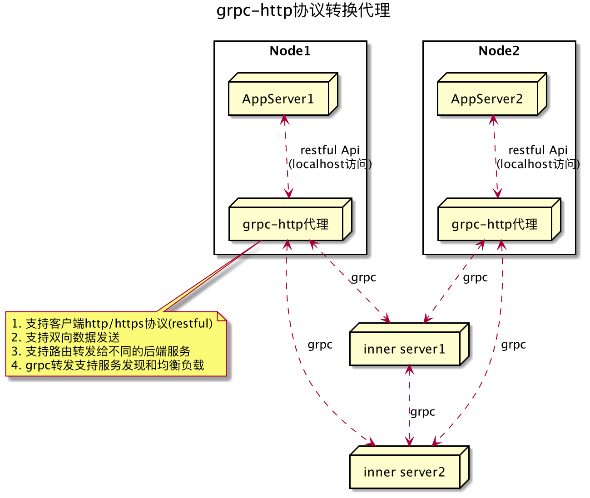
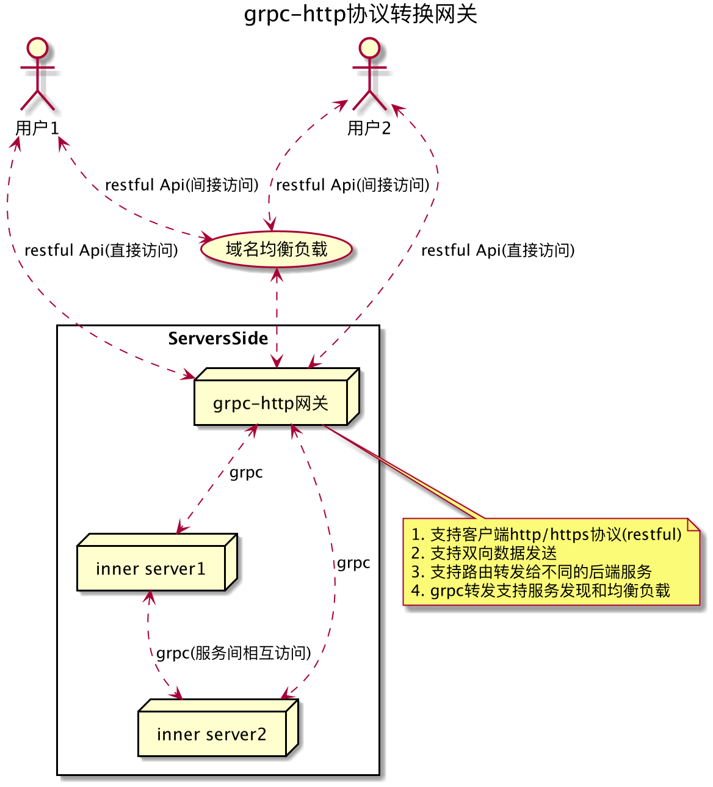

# Grpc-Http-Proxy

将http restful接口访问转换成grpc访问。

### 相关仓库

```
https://github.com/generalzgd/grpc-http-proxy
https://github.com/generalzgd/protoc-gen-grpc-httpgw
https://github.com/generalzgd/grpc-tcp-gateway-proto
```

### Proto文件生成
```shell script
protoc -Iiproto --go_out=plugins=grpc:./iproto ./iproto/backendsvr.proto
protoc -Iiproto --grpc-tcpgw_out=logtostderr=true:./iproto ./iproto/httpgate.proto
protoc -Iiproto --grpc-httpgw_out=logtostderr=true:./iproto ./iproto/httpgate.proto
```

### 特点

1. 客户端不用关心后端服务有哪些，只需知道网关地址。根据restful路径自动路由到后端服务并返回对应数据。
2. 支持双向数据发送
3. 不支持服务端主动下发消息给客户端
4. 同时支持protobuf和json两种协议格式
5. 对比grpc-ecosystem/grpc-gateway
   1. ecosystem需要为每个后端服务都注册一个网关地址和端口，客户端需要关心对应服务的网关和端口
6. 支持路由（restful路径）转发给不同的后端服务
7. grpc转发支持后端服务发现和均衡负载



